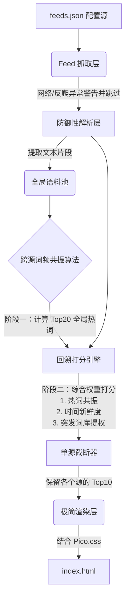

# Clean-News 架构文档

## 1. 系统概述
Clean-News 是一个极简、极其稳定的个人新闻聚合器。秉持防御性编程与全局文本共识的理念，通过纯本地文本处理（零重型数据库、零外部 AI 依赖），从多个 RSS 源中提取每天最值得关注的 Top 10 资讯，并以最轻量的方式渲染出支持暗黑模式的静态网页。

## 2. 核心架构流

## 3. 业务模块设计

### 3.1 预处理与抓取层 (Fetcher)
- **输入**: 项目根目录下的 `feeds.json`。
- **职责**: 使用 `feedparser` 遍历订阅源。对每个网络请求设置严格的超时。对待 403 / Cloudflare 拦截等不可抗力，执行“战略放弃”，仅打印 Warning 日志后即处理下一个源，保证程序永远不卡死报错。

### 3.2 防御性解析层 (Defensive Parser)
- **职责**: 剥离 RSS 树状结构的不可靠性。
- **机制**: 绝对禁用字典键强行访问（如 `item['summary']`），所有字段提取均使用带有默认空字符串的 `.get('key', '')` 模式。无条件接纳信息不全的条目（如只有标题无摘要，或者都没有），保证数据组装不抛出异常。

### 3.3 核心萃取层：跨源词频共振算法
本系统最核心的信息提炼机制分三步走：
1. **全局热词采集**: 收集当天抓取到的全部文章标题和摘要。英文采用正则分词，中文使用 `jieba` 分词。利用停用词表（Stopwords）剔除无意义介词/连词，最终计算得出当天的“Top 20 全网热词”。
2. **回溯共振打分**: 回到每一条具体的新闻，将自带的文本重新分词并与 Top 20 热词比对。命中热词越多、热词全局频次越高，该条新闻的“共振得分”也越高。
3. **特征提权**: 提取 RSS 自带的发布时间，对越接近运行时刻的新闻给予新鲜度加分；检测 `["突发", "重磅", "Breaking"]` 等硬编码高优词库，命中直接增加 100 分绝对权重。

经过以上算法，各源的新闻根据总分进行倒序排序，仅截取 Top 10 进入下一步。

### 3.4 极简展示层 (UI Generator)
- **职责**: 将数据灌入原生的 HTML 模板中，生成纯静态的 `index.html`。
- **样式**: `<head>` 中仅引入一组 `<link rel="stylesheet" href="https://cdn.jsdelivr.net/npm/@picocss/pico@2/css/pico.min.css">`。利用其强大的各种原生标签选择器，实现自动合理的排版比例和跟随系统切换的暗黑模式。

### 3.5 云端自动化流水线 (CI/CD)
- **技术**: GitHub Actions (`.github/workflows/main.yml`)
- **触发机制**: 北京时间早八点、晚八点各运行一次（Cron 配置）。
- **流程**: 拉取代码 -> 配置 Python 环境 -> 安装依赖 (feedparser, jieba) -> 运行主程序生成 index.html -> 执行 Git Commit -> Push 回 Main 分支触发 GitHub Pages 页面更新。
